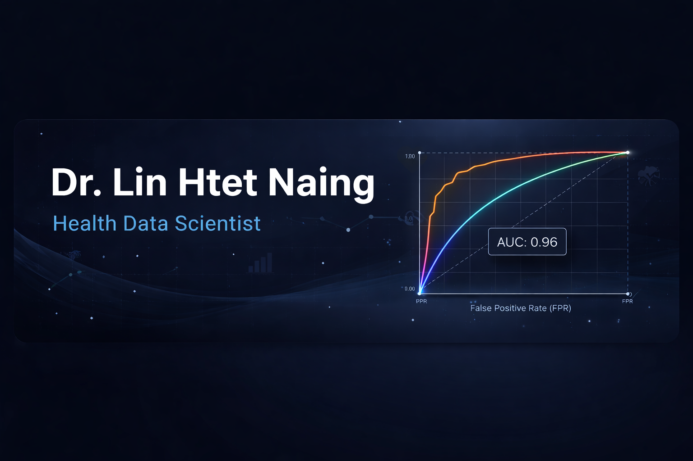

# 🩺 Health Data Scientist

🌱 **Currently specializing in Health Data Science**, I bridge the gap between complex health data and actionable insights. My focus is on building predictive models that solve real-world healthcare challenges.

---

### 🛠️ Tech Stack & Tools
  
  

* **Languages:** Proficient in **R** (Statistical Analysis, Predictive Modeling, Machine Learning); Experienced in **Python** (Machine Learning).
* **Data Infrastructure:** Architecting workflows using **Google BigQuery** and SQL.
* **Visualization:** Creating executive-level dashboards in **Power BI, Tableau, and Looker Studio.**

---

### 🔬 Featured Work
* **[Gallstone Disease Prediction](https://linhnslu.github.io/linhnslu/projects/gallstone.html):** Built and evaluated multiple machine learning models, and selected the best model based on performance and interpretability to predict risk of gallstone disease.
* **[Heart Failure Influential Modeling](https://linhnslu.github.io/heart_failure_clinical_records/):** Logistic Regression and CoxPH models with comprehensive model diagnostics

📫 **Let's connect!** I'm always open to discussing AI innovations in medicine or data-driven health solutions.

<!--
**linhnslu/linhnslu** is a ✨ _special_ ✨ repository because its `README.md` (this file) appears on your GitHub profile.

Here are some ideas to get you started:

- 🔭 I’m currently working on ...
- 🌱 I’m currently learning ...
- 👯 I’m looking to collaborate on ...
- 🤔 I’m looking for help with ...
- 💬 Ask me about ...
- 📫 How to reach me: ...
- 😄 Pronouns: ...
- ⚡ Fun fact: ...
-->
